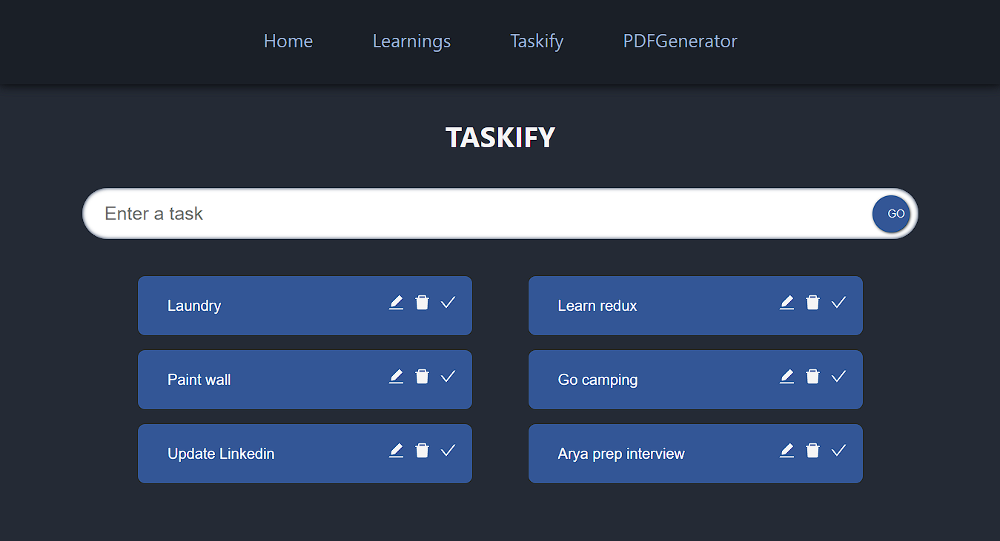
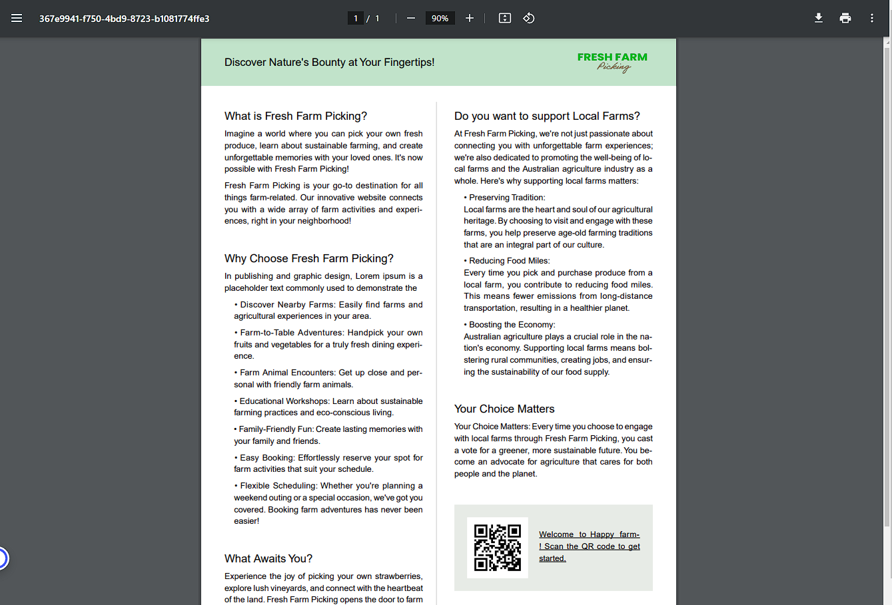

# This is a React with Typescript learning project

[LIVE DEMO](https://dianaleo.github.io/PDFGenerator_TodoList)

Three sections includes: 
- Learning React hooks
- Project 1 - Taskify
- Project 2 - PDFGenerator.

## Learning React hooks

- useState
- useEffect
- useRef
- useReducer
- useContext

## Project 1 - Taskify
- Taskify is a todo list, where you can add and delete your things to do, and toggle its status 
- Its state has three fields: id number, todo description, and complete or not status. It is stored in LocalStorage. And its logic is implemented in useReducer and useEffect
- It supports CRUD methods, which are implemented by useReducer hook
- Components have been destructed into the minimal and meaningful size

## Project 2 - PDFGenerator

- This project is a PDF file generator. Given a specific format of data, it generates a pdf file automatically 
- Data format definition is important. Genetic type is applied.
- Third-party libraries: its layout is implemented with '@react-pdf/renderer'. And the QR code is generated with 'qrcode'
 for more information.

